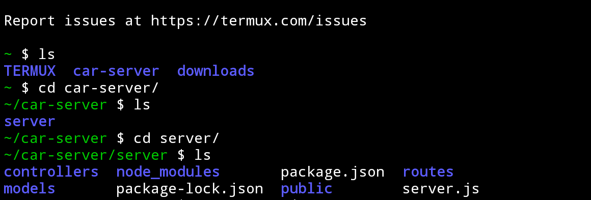
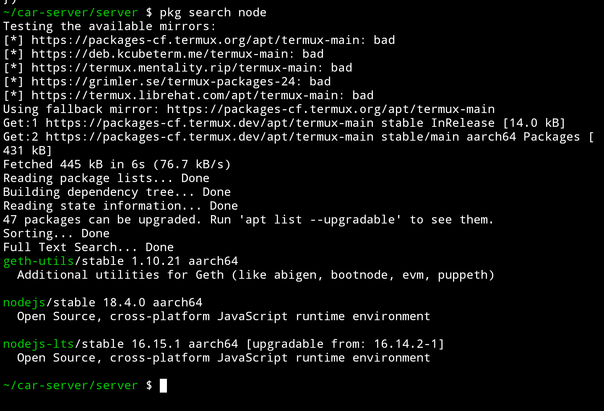

Ever been in a position where you are without your laptop? (*or it died on you unexpectedly for some arcane reason*), while you were in the middle of squashing a ladybug that wouldn't let users successfully sign up on your top of the line website.
>No?
Well okay I admit that was a little too specific. Anyways here's how to use your phone **by which I mean Android** to spin up a fully functional nodeJS environment for all your on the go Server maintenance needs /s.
**First** you would want to 
## Download and Install the Termux app. 🧊
You would find a *version* on the Play store but I wouldn't recommend using that as it is outdated, unmaintained and possibly deprecated, so just head over to the official [GitHub Repo here](https://github.com/termux/termux-app/releases/tag/v0.118.0) and download the latest version *0.118.0* at the time of writing.
Or if you got beef with Microsoft you can as well get the latest version from [Fdroid](https://f-droid.org/en/packages/com.termux/), a great Open source application hosting site for Android.
Okay so what is Termux exactly? You may ask.
Well as the name would imply Termux is a ***Terminal emulator and Linux environment that runs on [Android's Linux kernel ](https://www.computerworld.com/article/2741578/are-android-and-linux-the-same-thing-.html).*** 
Termux combines powerful terminal emulation with an extensive Linux package collection.
With Termux you can:
• Enjoy the bash and zsh shells.
• Manage files with nnn and edit them with nano, vim or emacs.
• Access servers over ssh.
• Develop in C with clang, make and gdb.
• Use the python console as a pocket calculator.
• Check out projects with git.
• Run text-based games with frotz.
And much more... But let's get back to certain time here. We just want a simple nodeJS application.

Next step would be..
## Launching the App 🍷
No brainer, press on it 👀

You would be greeted with a black screen much like, if not exactly like this

Looks familiar? Ofc it does. It's textbook terminal output.

Now let's see if it's functional,
I have tried out some simple Linux Commands like mkdir, ls, cd and cat

You will notice I already have some fully fledged applications in that directory, this is because I have previously installed Git and used it to pull a repository from my remote to work on with my phone.  For you it's all most likely a blob of emptiness. That's normal, and should be expected.

>Okay that's cool and all, but how do I actually install Node You may ask. We are getting there.
### So Thirdly
As you may have seen from my previous screenshot, Termux's package install command goes a bit like
`pkg install <package-name>`
 And another useful command also on the image is
 `pkg search <package-name>`
 And yes it does what you think it does.
#### Using the search command we can check to see if our package manager even has this thing called Node.
To do that we would.. you guessed it, do a search with 
`pkg search node`
This returns

And we can see that they have the Node v16 and v18, i.e. stable and the latest versions as at the time of writing.
> Note: If you get an older version or nothing found, then try doing `pkg upgrade` before proceeding with the next step.
### Install Node
To install, use the install command
`pkg install nodejs-lts` or `pkg install nodejs`
Making sure you spell it exactly is it was on the search result.
If successful you would get something like 
*Or maybe a little different, because I only did an update from nodev16.14 to nodev16.15 but you get the idea.*
### Finally 
Do a `node -v` to check if it's installed correctly.

And there you have it, a fully functional nodeJS environment on your smartphone.

> NB Termux persists as a background service (*In case you have a server running.* 👀) so when you are done using it always close it completely from your notification drop-down.
Like so,

Stay tuned (or follow) for my post on setting up a complete authentication flow on our mobile environment using Node, Express, and a really cool Postman alternative.

